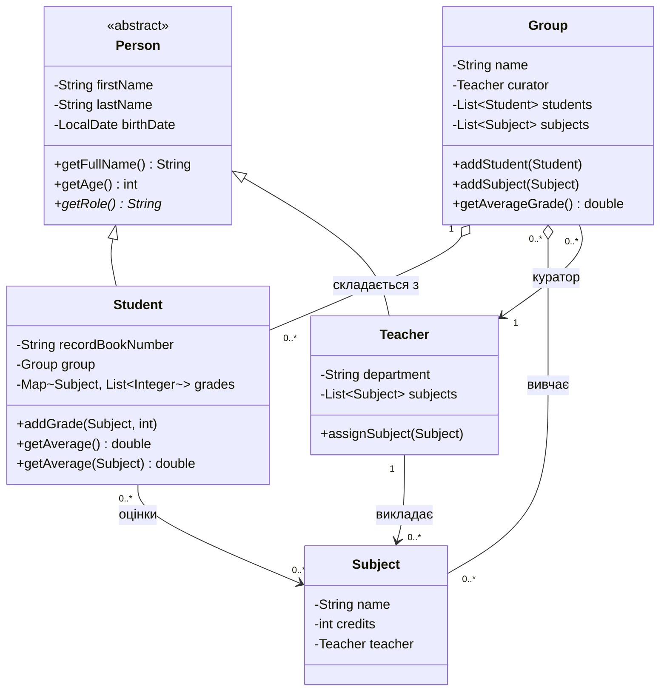

# University Class Hierarchy (Java)

Ієрархія класів: **Person → Student / Teacher**, а також **Group** та **Subject**.

## UML-діаграма



## Запуск

```bash
mkdir out
javac -d out src/com/university/*.java
java -cp out com.university.Main
```
